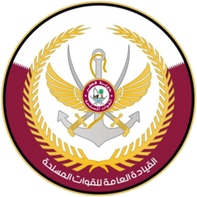
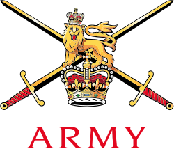
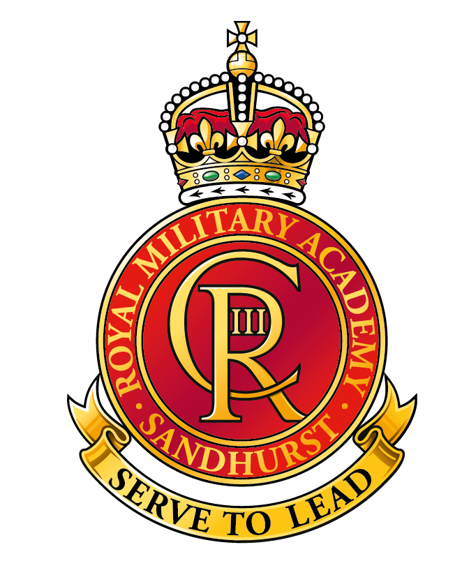
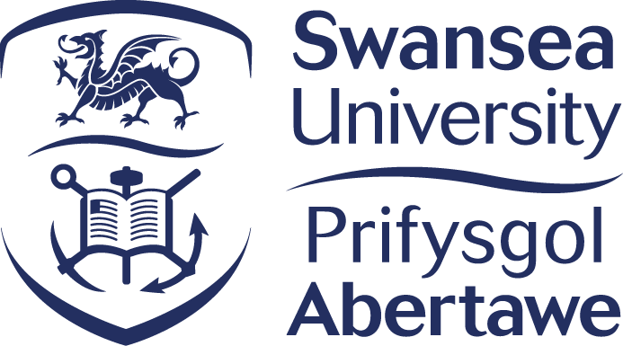

::::: degree
::: degree-logo

:::

::: degree-info
<h3>PhD Ecology</h3>

Imperial College London · Silwood Park, UK · 2023–Present

:::
:::::

::::: degree
::: degree-logo

:::

::: degree-info
<h3>BSc Biological Sciences</h3>

Imperial College London · London, UK · 2020–2023

:::
:::::

::::: degree
::: degree-logo

:::

::: degree-info
<h3>Qatar Armed Forces</h3>

2018–2020

At the Ahmed Bin Mohammed Military Academy I worked in training design and delivery, and also acted as a liaison for officer cadets attending international courses.

:::
:::::

::::: degree
::: degree-logo

:::

::: degree-info
<h3>British Army</h3>

2016–2018

I worked as a Group Leader for the Army Officer Selection Board at Westbury. I was responsible for facilitating the candidate experience of officer selection over three and a half days of diverse assessments.

:::
:::::

::::: degree
::: degree-logo

:::

::: degree-info
<h3>UNDP</h3>

2015–2016

Between November 2015 and December 2016 I worked in Central Asia (Tajikistan and Afghanistan) over 5 short-term contracts to plan and deliver instructor training courses for members of the Afghan Border Police. I worked for EU-BOMNAF (EU Border Management in Northern Afghanistan), a UNDP project focussed on long-term border management.

:::
:::::

::::: degree
::: degree-logo

:::

::: degree-info
<h3>Self-employed contractor</h3>

2015–Present

As a self-employed training and education consultant I developed and delivered on multiple projects for Fieri - a leadership and team development company.

:::
:::::

::::: degree
::: degree-logo

:::

::: degree-info
<h3>Teacher Active</h3>

2015–2016

Rowdeford School in Devizes is a specialist secondary school for communication and interaction. I was responsible for Year 9 form. Planned and delivered PE, literacy, and learning outside the classroom to children with special educational needs, aged 11 to 16.

:::
:::::

::::: degree
::: degree-logo

:::

::: degree-info
<h3>British Army</h3>

2013-2017

I was the single point of contact and subject matter expert for wounded, injured and sick service people at Headley Court and within the Recovery Unit in my area of responsibility (Aldershot).  I provided advice on education and training as well as career guidance and signposting support. During this role, I also achieved a MSc in Education.

::::: degree
::: degree-logo

:::

::: degree-info
<h3>MSc</h3>

University of Southampton · 2014–2017

:::
:::::

:::
:::::

::::: degree
::: degree-logo

:::

::: degree-info
<h3>British Army - Operational Tour of Afghanistan</h3>

2013

I worked at the Joint Theatre Education Centre in Camp Bastion, Afghanistan, as part of a small team. We provided mandatory education courses to soldiers, enabling them to remain eligible for career progression despite being deployed. I was responsible for the planning, implementation and assessment of the Level 1 and 2 Literacy and Numeracy programme that ran throughout the tour.

:::
:::::

::::: degree
::: degree-logo

:::

::: degree-info
<h3>British Army</h3>

2011–2013

I worked in an education centre in Tidworth to deliver courses in Command, Leadership and Management to soldiers. I also worked for my PGCE during this time, and learned to deliver language and culture courses to support operational deployments to Afghanistan.

::::: degree
::: degree-logo

:::

::: degree-info
<h3>PGCE</h3>

University of Southampton · 2011–2013

:::
:::::

:::
:::::

::::: degree
::: degree-logo

:::

::: degree-info
<h3>RMAS - Regular Commissioning Course</h3>

2010–2011

The Regular Commissioning Course at the Royal Military AcademySandhurst is an intensive leadership course that prepares officers to lead soldiers in war and peacetime. The course covers basic military skills, decision making, and leadership in increasingly complex scenarios over the course of 44 weeks.

:::
:::::

::::: degree
::: degree-logo

:::

::: degree-info
<h3>BA English</h3>

University of Swansea · Swansea, UK · 2007–2010

:::
:::::
