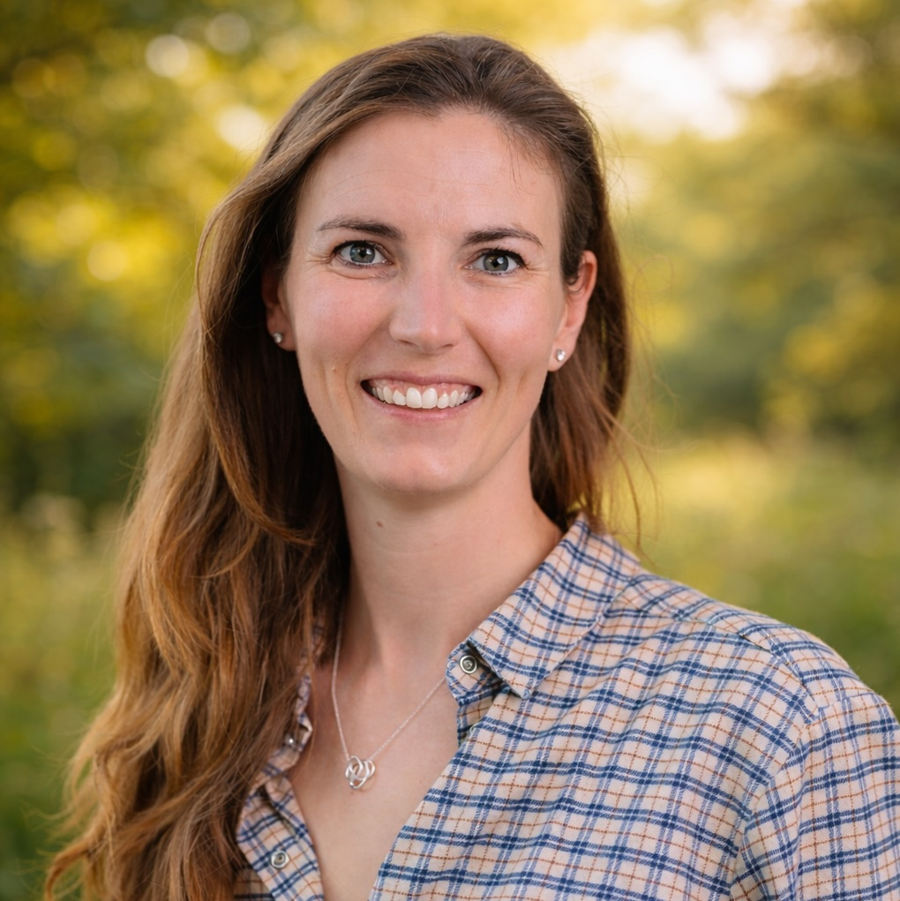

::: site-banner
:::

:::::::: hero
:::::: hero-copy
::: eyebrow
ECOLOGY · IMPERIAL COLLEGE LONDON
:::

# N. J. Pates

::: hero-role
PhD Researcher
:::
::::::
::: hero-photo

:::
::::::::

## About

I am a PhD researcher in the Department of Life Sciences at Imperial College London, and part of the Science and Solutions for a Changing Planet Doctoral Training Partnership (SSCP DTP). I am based at Silwood Park, Imperial's dedicated centre for ecology, evolution, and conservation.

## Research

My research is focused on rewilding - allowing natural processes to recover in damaged habitats. I have combined fieldwork, statistical, and molecular techniques to investigate how landscapes change when they are rewilded and develop methods and metrics to allow us to study this subject more quantitatively. I want to answer questions like: how can we measure changes in biodiversity under rewilding? How does rewilding impact different taxonomic groups? Can we say if rewilding is working?

During my PhD, I have been fortunate to conduct fieldwork around the UK: at the Knepp Estate in Sussex; at two rewilding projects overseen by Nattergal (Boothby and High Fen); at a selection of UK National Trust sites in the south of England; and at RSPB Haweswater in the Lake District.

## Contact

The best way to contact me is by email: nell.pates20\@imperial.ac.uk

## Links

[Google Scholar](https://scholar.google.com/citations?user=WGfUlWwAAAAJ&hl=en)

[ORCiD](https://orcid.org/0009-0005-7444-651X)

[Imperial College London](https://profiles.imperial.ac.uk/nell.pates20)
